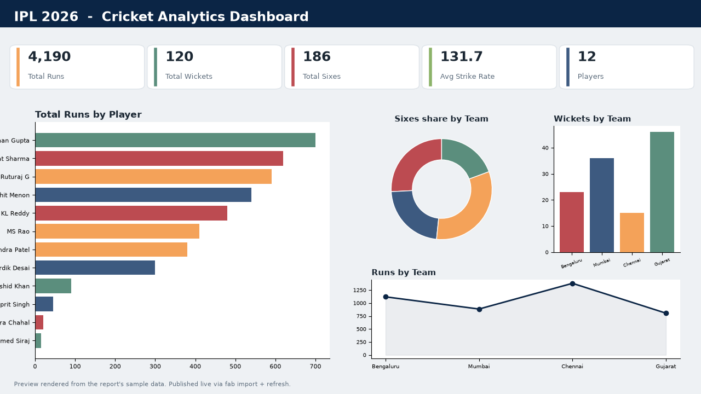
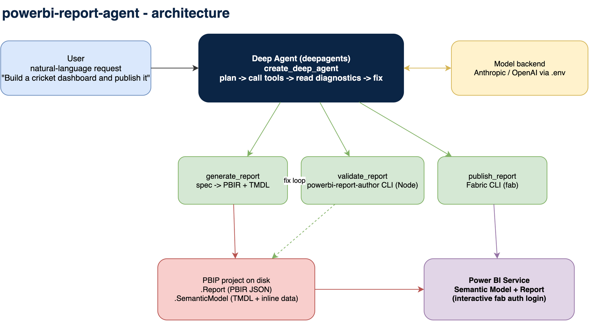

# powerbi-report-agent

An AI agent that builds and publishes real Power BI reports from natural language. It is
a [Deep Agent](https://github.com/langchain-ai/deepagents) whose tools generate the report
files as code, validate them with Microsoft's official CLI, and publish them to the Power
BI service. No Power BI Desktop and no Windows required: everything runs headless on macOS,
Linux, or Windows.



*A two page cricket analytics dashboard authored and published by the agent (preview
rendered from the report's own sample data).*

## What it does

Give it a request like *"Build an IPL cricket analytics dashboard with KPI cards, a runs by
player bar chart, a sixes by team donut, a stats matrix, slicers, and page navigation, then
publish it to my workspace."* The agent then:

1. Designs the dashboard: sample data, DAX measures, pages, and a rich mix of visuals.
2. Generates the PBIP project (PBIR report JSON + a TMDL semantic model with inline data).
3. Validates it with `powerbi-report-author` and fixes any schema errors.
4. Publishes it to the Power BI service and returns the report URL.

## Architecture



The agent is thin. The intelligence is the author -> validate -> fix loop: the model writes
a spec, the generator turns it into files, the Microsoft CLI returns structured diagnostics,
and the model corrects its spec until validation passes. Only then does it publish.

- **Generate** (`generator.py`): a `ReportSpec` becomes a real `.pbip` project. Pure, offline.
- **Validate** (`validator.py`): wraps `powerbi-report-author validate` (Node, no Desktop).
- **Publish** (`publisher.py`): wraps the Fabric CLI (`fab`): import the model, rebind the
  report by connection, import the report, and refresh so the data loads.

## Requirements

- Python 3.11+
- Node.js 20+ with the Microsoft authoring CLIs:
  ```bash
  npm install -g @microsoft/powerbi-report-authoring-cli@latest @microsoft/powerbi-desktop-bridge-cli@latest
  ```
- The Fabric CLI for publishing:
  ```bash
  pip install ms-fabric-cli
  fab auth login
  ```
- A model API key for the natural-language agent (see `.env.example`).

## Quickstart

```bash
# 1. install the package
pip install -e ".[anthropic]"

# 2. configure (copy and fill in)
cp .env.example .env

# 3a. deterministic path: build + validate an example, no model key needed
python examples/cricket_spec.py

# 3b. publish it (needs `fab auth login`)
pbi-report-agent publish ./build/CricketAnalytics CricketAnalytics "My workspace.Personal"

# 4. or drive the whole thing with natural language
pbi-report-agent chat "Build a sales dashboard with 4 KPI cards, a bar chart and a slicer, and publish it"
```

## Configuration

All configuration lives in a local `.env` file (gitignored). Copy `.env.example` and set:

- `ANTHROPIC_API_KEY` (or `OPENAI_API_KEY`): the model backend for the `chat` agent.
- `PBI_AGENT_MODEL`: the LangChain model id, e.g. `claude-sonnet-4-5-20250929`.
- `PBI_TARGET_WORKSPACE`: the Fabric workspace to publish into.
- `PBI_OUTPUT_DIR`: where generated projects are written.

Publishing authenticates interactively through `fab auth login`, so no client secret is ever
stored in this repo.

## Repo layout

```
src/pbi_report_agent/
  models.py       typed ReportSpec (model, pages, visuals)
  generator.py    ReportSpec -> PBIR + TMDL files
  validator.py    wraps powerbi-report-author validate
  publisher.py    wraps fab import + rebind + refresh
  agent.py        the deepagents agent and its tools
  cli.py          chat / build / publish commands
docs/             architecture diagram, auth and API notes
examples/         cricket_spec.py plus two full example projects
skills/           pointer to the Microsoft skills-for-fabric agent skills
```

## Notes and credits

Report authoring uses Microsoft's [skills-for-fabric](https://github.com/microsoft/skills-for-fabric)
CLIs and the PBIR / TMDL project format. See `docs/` for the auth model and the exact REST
and CLI calls used.

## License

MIT. See [LICENSE](LICENSE).
